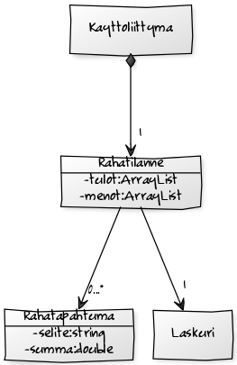

# Aihe 
Budjettilaskuri, jonka perusideana on laskea syötettyjen tulojen ja menojen jälkeen, kuinka paljon rahaa jää käytettäväksi. 

Sovellukseen syötetään tekstikenttiin kuukausittaiset tulot, kuten palkka ja kuukausittaiset menot, kuten matkakortin hinta, vakuutukset, sähkölasku, ruoka, bensiini jne. Sovellus laskee kuinka paljon rahaa merkittyjen menojen jälkeen jää, ja näyttää jäljelle jäävän kuukausittaisen, viikottaisen ja päivittäisen käyttöraha-budjetin. Sovellukseen voi myös esimerkiksi syöttää paljonko tahtoisi saada säästöön joka kuukausi, ja tämä huomioidaan laskuissa. 

Sovellus myös graafisesti esittää, miten menot jakautuvat. Esimerkiksi ruoan osuuden menoista voisi suhteuttaa visuaalisesti alkoholimenoihin, mikäli ne ovat merkitty. Tämän lisäksi sovellus tarjoaisi mahdollisuuden tallentaa laskemat tiedostoon ja täten tulostaa ne myöhäisempää tarkastelua varten.

**Käyttäjä:** Kuka tahansa, joka tahtoo laskea budjettinsa 

**Käyttäjän toiminnot:**
* Menojen ja tulojen syöttäminen
* Kuukausi-, viikko- ja päiväbudjetin laskenta
* Graafisten esitysten tarkastelu
* Budjetin tietojen tulostus

# Rakenne

**Luokkakaavio**

