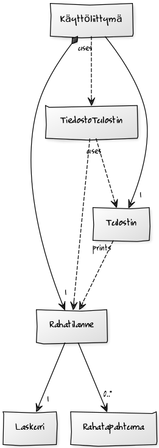

# Aihe 
Budjettilaskuri, jonka perusideana on laskea syötettyjen tulojen ja menojen jälkeen, kuinka paljon rahaa jää käytettäväksi. 

Sovellukseen syötetään tekstikenttiin kuukausittaiset tulot, kuten palkka ja kuukausittaiset menot, kuten matkakortin hinta, vakuutukset, sähkölasku, ruoka, bensiini jne. Sovellus laskee kuinka paljon rahaa merkittyjen menojen jälkeen jää, ja näyttää jäljelle jäävän kuukausittaisen, viikottaisen ja päivittäisen käyttöraha-budjetin. Sovellukseen voi myös esimerkiksi syöttää paljonko tahtoisi saada säästöön joka kuukausi, ja tämä huomioidaan laskuissa. 

Sovellus myös tarjoaa mahdollisuuden tallentaa budjettilaskemat tiedostoon ja täten tulostaa ne myöhäisempää tarkastelua varten.

**Käyttäjä:** Kuka tahansa, joka tahtoo laskea budjettinsa 

**Käyttäjän toiminnot:**
* Menojen ja tulojen syöttäminen
* Kuukausi-, viikko- ja päiväbudjetin laskenta
* Budjetin tietojen tulostus .txt-tiedostoon

# Rakenne
**Rakennekuvaus** 

Ohjelma rakentuu neljään pakettiin: budjetti, logiikka, main ja gui. Gui-paketti sisältää graafisen käyttöliittymän. Lisäksi gui-paketin alla on paketti gui.kuuntelijat, joka sisältää graafisen käyttöliittymän eri JButtonien ActionListenerit. Luotaessaan graafinen käyttöliittymä tarvitsee parametrikseen Rahatilanteen. 

  Rahatilanne sijaistee budjetti-paketissa. Rahatilanteella on Laskuri, jonka lisäksi Rahatilanteeseen liittyy nollasta useaan Rahatapahtumaa. Rahatapahtumat talletetaan Rahatilanteessa kahteen ArrayListiin, tuloihin ja menoihin. Rahatapahtuma sisältyy myös budjetti-pakettiin. Rahatapahtumalla on string-muotoinen selite ja int-muotoinen määrä. 
  
  Logiikka-pakettiin sisältyvät jo aiemmin mainittu Laskuri, TiedostoTulostin ja Tulostin. Graafisella käyttöliittymällä on Tulostin, jota se antaa kuuntelijoilleen. Käytettäessä Tulostimelle annetaan Rahatilanne, jota Tulostin käyttää tulostaessaan Rahatilanteen eri komponentteja. Käyttöliittymä käyttää myös TiedostoTulostin-luokkaa, joka saa metodinsa parametrina sekä Tulostin-olion, että Rahatilanteen. 
  
  Main-paketti sisältää Main-luokan, jolla ohjelma ajetaan. 

**Luokkakaavio**

**Sekvenssikaaviot:**

